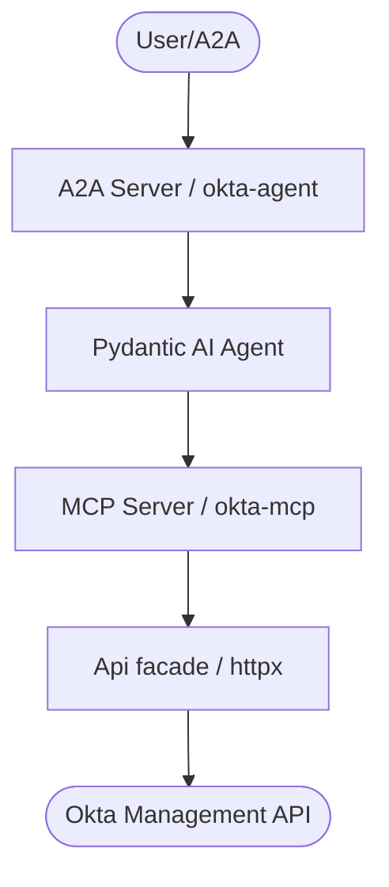

# Okta Agent
## CLI or API | MCP | Agent


*Version: 0.5.0*

> **Documentation** — Installation, deployment, usage across the API, CLI, and MCP
> server live on the docs site:
> <https://knuckles-team.github.io/okta-agent/>

## Table of Contents

- [Overview](#overview)
- [Architecture](#architecture)
- [Installation](#installation)
- [Configure](#configure)
- [Environment Variables](#environment-variables)
- [Quick Start](#quick-start)
- [Run](#run)
- [MCP Tools](#mcp-tools)
- [Deployment](#deployment)
- [Keycloak Parity](#keycloak-parity)
- [Development](#development)

## Overview

Enterprise CIAM/SSO connector for the agent fleet: a production-grade MCP
server and Pydantic AI agent over the **Okta Management API** — users, groups,
applications, policies, and the system log. Complements `keycloak-agent`
(open-source IdP) with the commercial-IdP side of the house, mirroring its
verb taxonomy so agents can switch IdPs with familiar verbs.

- Raw `httpx` client — no Okta SDK; every method documents the endpoint it calls.
- Two auth modes: **SSWS API token** and **OAuth2 private-key-JWT** (org
  authorization server, Okta API scopes).
- Rate-limit aware: every response envelope carries the latest
  `X-Rate-Limit-*` snapshot; HTTP 429 triggers capped automatic backoff.
- Cursor pagination via `Link: rel="next"` headers (Okta's `after` cursor),
  with hard item caps and resumable `next_cursor`s.
- Safety: destructive operations (deactivate / delete / clear sessions /
  password ops) are blocked unless explicitly allowed; credential material is
  redacted from logs and error envelopes.

## Architecture



## Installation

> **Install the slim `[mcp]` extra.** For MCP-server hosting (including `uvx` /
> container deploys), install `okta-agent[mcp]` — the MCP-server extra that pulls
> only the FastMCP / FastAPI tooling (`agent-utilities[mcp]`). It deliberately
> **excludes** the heavy agent runtime (the epistemic-graph engine, `pydantic-ai`,
> `dspy`, `llama-index`, `tree-sitter`), so installs are dramatically smaller and
> faster. Use the full `[agent]` extra only when you need the integrated Pydantic
> AI agent.

Pick the extra that matches what you want to run:

| Extra | Installs | Use when |
|-------|----------|----------|
| `okta-agent[mcp]` | Slim MCP server only (`agent-utilities[mcp]` — FastMCP/FastAPI) | You only run the **MCP server** (smallest install / image) |
| `okta-agent[agent]` | Full agent runtime (`agent-utilities[agent,logfire]` — Pydantic AI + the epistemic-graph engine) | You run the **integrated A2A agent** |
| `okta-agent[all]` | Everything (`mcp` + `agent` + `logfire`) | Development / both surfaces |

```bash
pip install okta-agent            # core API client
pip install okta-agent[mcp]       # slim MCP server (FastMCP/FastAPI)
pip install okta-agent[agent]     # full A2A agent runtime + epistemic-graph engine
pip install okta-agent[all]       # everything (development)
```

### Container images (`:mcp` vs `:agent`)

One multi-stage `docker/Dockerfile` builds two right-sized images, selected by `--target`:

| Image tag | Build target | Contents | Entrypoint |
|-----------|--------------|----------|------------|
| `knucklessg1/okta-agent:mcp` | `--target mcp` | `okta-agent[mcp]` — **slim**, no engine/`pydantic-ai`/`dspy`/`llama-index`/`tree-sitter` | `okta-mcp` |
| `knucklessg1/okta-agent:latest` | `--target agent` (default) | `okta-agent[agent]` — **full** agent runtime + epistemic-graph engine | `okta-agent` |

```bash
docker build --target mcp   -t knucklessg1/okta-agent:mcp    docker/   # slim MCP server
docker build --target agent -t knucklessg1/okta-agent:latest docker/   # full agent
```

`docker/mcp.compose.yml` runs the slim `:mcp` server; `docker/agent.compose.yml` runs the
agent (`:latest`) with a co-located `:mcp` sidecar.

### Knowledge-graph database (`epistemic-graph`)

The **full agent** (`[agent]` / `:latest`) embeds the **epistemic-graph** engine (pulled in
transitively via `agent-utilities[agent]`). For production — or to share one knowledge graph
across multiple agents — run **epistemic-graph as its own database container** and point the
agent at it instead of embedding it. Deployment recipes (single-node + Raft HA), connection
config, and the full database architecture (with diagrams) are documented in the
[epistemic-graph deployment guide](https://knuckles-team.github.io/epistemic-graph/deployment/).
The slim `[mcp]` server does **not** require the database.

## Configure

```bash
export OKTA_ORG_URL="https://acme.okta.com"

# Mode 1 — SSWS API token (takes precedence)
export OKTA_API_TOKEN="<api token>"

# Mode 2 — OAuth2 private-key-JWT (service app, Okta API scopes)
export OKTA_CLIENT_ID="0oa..."
export OKTA_PRIVATE_KEY_FILE="/path/to/key.pem"   # or OKTA_PRIVATE_KEY inline
export OKTA_SCOPES="okta.users.read okta.groups.manage"
```

See `.env.example` for every knob (`OKTA_SSL_VERIFY`, `OKTA_MAX_RETRIES`,
`OKTA_BACKOFF_CAP_SECONDS`, `OKTA_ALLOW_DESTRUCTIVE`, per-tool switches).

## Environment Variables

| Variable | Default | Purpose |
|----------|---------|---------|
| `OKTA_ORG_URL` | — | Okta org URL, no trailing slash (`OKTA_AGENT_BASE_URL` accepted as fallback) |
| `OKTA_API_TOKEN` | — | SSWS API token (auth mode 1, takes precedence) |
| `OKTA_CLIENT_ID` | — | Service-app client id (private-key-JWT) |
| `OKTA_PRIVATE_KEY` / `OKTA_PRIVATE_KEY_FILE` | — | PEM private key inline or path |
| `OKTA_KEY_ID` | — | Optional JWKS key id for the client assertion |
| `OKTA_SCOPES` | read scopes | Space-separated Okta API scopes |
| `OKTA_SSL_VERIFY` | `True` | TLS verification toward the org |
| `OKTA_MAX_RETRIES` | `2` | 429 retry attempts |
| `OKTA_BACKOFF_CAP_SECONDS` | `60` | 429 backoff cap |
| `OKTA_ALLOW_DESTRUCTIVE` | `False` | Org-wide default for destructive tool actions |
| `HOST` / `PORT` / `TRANSPORT` | `0.0.0.0` / `8000` / `stdio` | MCP server bind + transport |
| `USERSTOOL` / `GROUPSTOOL` / `APPSTOOL` / `POLICIESTOOL` / `SYSTEMTOOL` | `True` | Per-domain tool toggles |
| `ENABLE_OTEL` / `OTEL_EXPORTER_OTLP_*` | — | Telemetry (OTEL / Langfuse) |
| `EUNOMIA_TYPE` / `EUNOMIA_POLICY_FILE` / `EUNOMIA_REMOTE_URL` | `none` | MCP authorization middleware |
| `AUTH_TYPE` | `none` | MCP server auth mode (Docker) |
| `DEFAULT_AGENT_NAME` / `AGENT_DESCRIPTION` / `AGENT_SYSTEM_PROMPT` | identity files | A2A agent identity overrides |

## Quick Start

```python
from okta_agent import Api
from okta_agent.api.credentials import SswsToken
from okta_agent.okta_input_models import SearchInput, FilterCondition

api = Api(org_url="https://acme.okta.com", credential=SswsToken("<token>"))

active = api.search_users(
    conditions=[{"field": "status", "op": "eq", "value": "ACTIVE"}],
)
print(active["data"], active["rate_limit"])

# Or build typed tool params for the MCP surface:
params = SearchInput(
    conditions=[FilterCondition(field="status", op="eq", value="ACTIVE")]
).model_dump_json(exclude_none=True)
```

## Run

```bash
okta-mcp                                  # stdio MCP server
okta-mcp --transport streamable-http --host 0.0.0.0 --port 8000
okta-agent                                # A2A agent server
```

## MCP Tools

Five consolidated, action-routed tools. Each takes `action`, `params_json`,
and (where applicable) `allow_destructive`.

<!-- This table is auto-generated by `python -m agent_utilities.mcp.readme_tools` — do not edit by hand. -->

<!-- MCP-TOOLS-TABLE:START -->

| MCP Tool | Toggle Env Var | Description |
|----------|----------------|-------------|
| `okta_apps` | `APPSTOOL` | Manage Okta applications — CRUD, lifecycle, and user/group assignments. |
| `okta_groups` | `GROUPSTOOL` | Manage Okta groups — CRUD, membership, and dynamic group rules. |
| `okta_policies` | `POLICIESTOOL` | Inspect Okta policies and toggle policy/rule lifecycle. |
| `okta_system` | `SYSTEMTOOL` | Inspect the Okta org — settings, auth servers, system log, authenticators, zones. |
| `okta_users` | `USERSTOOL` | Manage Okta users — lifecycle, credentials, groups/apps/factors, sessions. |

_5 action-routed tools (default `MCP_TOOL_MODE=condensed`). Each is enabled unless its toggle is set false; set `MCP_TOOL_MODE=verbose` (or `both`) for the 1:1 per-operation surface. Auto-generated — do not edit._
<!-- MCP-TOOLS-TABLE:END -->

### Examples

```json
{"action": "search", "params_json": "{\"conditions\": [{\"field\": \"status\", \"op\": \"eq\", \"value\": \"ACTIVE\"}, {\"field\": \"profile.department\", \"op\": \"eq\", \"value\": \"Engineering\"}]}"}
```

```json
{"action": "create", "params_json": "{\"template\": \"oidc\", \"label\": \"My App\", \"settings\": {\"redirect_uris\": [\"https://app.example.com/cb\"]}}"}
```

```json
{"action": "deactivate", "params_json": "{\"user_id\": \"00u1\"}", "allow_destructive": true}
```

Every successful response is an envelope:

```json
{"data": [...], "rate_limit": {"limit": 600, "remaining": 599, "reset": 1700000000}, "count": 5, "truncated": false, "next_cursor": null}
```

Errors map Okta's envelope: `{"error": {"status", "error_code", "error_summary", "error_id", "error_causes", "rate_limit"}}`.

## Deployment

```bash
# MCP server only (port 8000, streamable-http, /health)
docker compose -f docker/mcp.compose.yml up -d

# MCP server + A2A agent server (agent on port 9021, AG-UI web interface)
docker compose -f docker/agent.compose.yml up -d
```

The A2A agent server (`okta-agent` console script, `agent_server.py`) reads
`MCP_URL`, `PROVIDER`, and `MODEL_ID` from the environment. Prebuilt images:
`knucklessg1/okta-agent:mcp` (slim MCP server) and `knucklessg1/okta-agent:latest`
(full agent) — see [Container images](#container-images-mcp-vs-agent). See
[docs/deployment.md](docs/deployment.md) for transports, reverse proxy, and DNS
guidance.

<!-- BEGIN GENERATED: additional-deployment-options -->
### Additional Deployment Options

`okta-agent` can also run as a **local container** (Docker / Podman / `uv`) or be
consumed from a **remote deployment**. The
[Deployment guide](https://knuckles-team.github.io/okta-agent/deployment/) has full, copy-paste
`mcp_config.json` for all four transports — **stdio**, **streamable-http**,
**local container / uv**, and **remote URL**:

- **Local container / uv** — launch the server from `mcp_config.json` via `uvx`,
  `docker run`, or `podman run`, or point at a local streamable-http container by `url`.
- **Remote URL** — connect to a server deployed behind Caddy at
  `http://okta-mcp.arpa/mcp` using the `"url"` key.
<!-- END GENERATED: additional-deployment-options -->

## Keycloak parity

Verbs intentionally mirror `keycloak-agent` where the concepts overlap, so an
agent fluent in one IdP connector can drive the other:

| Concept | keycloak-agent | okta-agent |
|---------|----------------|------------|
| Users CRUD | `keycloak_agent_users` list/get/create/update | `okta_users` list/get/create/update |
| Password reset | `reset_password` | `reset_password` (plus expire_password) |
| User's groups | `list_users_by_user_id_groups` | `list_groups` |
| Groups CRUD + members | `keycloak_agent_groups` | `okta_groups` (+ Okta group rules) |
| OAuth/SAML clients | `keycloak_agent_clients` | `okta_apps` (Keycloak "clients" = Okta "apps") |
| Auth policies/flows | `keycloak_agent_authentication` | `okta_policies` (read + lifecycle) |
| Server/org info & events | `keycloak_agent_info` / attack detection | `okta_system` (org + system log) |

Okta-only surface: lifecycle states (suspend/unlock), group rules, app
assignment profiles, network zones, Okta API scopes via private-key-JWT.

## Development

```bash
pip install -e .[mcp,test]
pytest -v
pre-commit run --all-files
```

API references are cited in every client docstring
(https://developer.okta.com/docs/api/).


<!-- BEGIN agent-os-genesis-deploy (generated; do not edit between markers) -->

## Deploy with `agent-os-genesis`

This package can be provisioned for you — skill-guided — by the **`agent-os-genesis`**
universal skill (its *single-package deploy mode*): it picks your install method, seeds
secrets to OpenBao/Vault (or `.env`), trusts your enterprise CA, registers the MCP
server, and verifies it — the same machinery that stands up the whole Agent OS, narrowed
to just this package. Ask your agent to **"deploy `okta-agent` with agent-os-genesis"**.

| Install mode | Command |
|------|---------|
| Bare-metal, prod (PyPI) | `uvx okta-mcp` · or `uv tool install okta-agent` |
| Bare-metal, dev (editable) | `uv pip install -e ".[all]"` · or `pip install -e ".[all]"` |
| Container, prod | deploy `knucklessg1/okta-agent:latest` via docker-compose / swarm / podman / podman-compose / kubernetes |
| Container, dev (editable) | deploy `docker/compose.dev.yml` (source-mounted at `/src`; edits live on restart) |

Secrets are read-existing + seeded via `vault_sync` — you are only prompted for what's missing.

<!-- END agent-os-genesis-deploy -->
