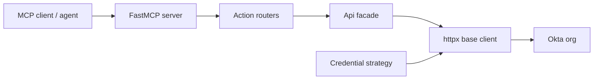

# Overview

`okta-agent` wraps the Okta Management API in five consolidated, action-routed
MCP tools backed by a raw `httpx` client (no Okta SDK).

## Architecture



- **Credential strategies** (`okta_agent/api/credentials.py`): SSWS API token
  or OAuth2 private-key-JWT against the org authorization server. Tokens are
  cached and refreshed before expiry; secret material is registered for
  redaction.
- **Base client** (`okta_agent/api/api_client_base.py`): auth-header
  injection, `X-Rate-Limit-*` tracking, capped 429 backoff, `Link`-header
  cursor pagination, Okta error-envelope mapping, secret redaction.
- **Domain clients** (`api_client_users/groups/apps/policies/system.py`): one
  method per endpoint, the API reference cited in each docstring.
- **MCP tools** (`okta_agent/mcp/`): thin action routers; no business logic.

## Safety model

Destructive operations — deactivations, deletes, session clears, password
operations, assignment removals — return a structured refusal unless the call
carries `allow_destructive=true` or the org sets `OKTA_ALLOW_DESTRUCTIVE=True`.
System-log queries are hard-capped at 1000 events per call with a resumable
cursor. Credential material (SSWS tokens, bearer tokens, private keys) never
appears in logs or error envelopes.

## Response envelope

Every success carries the latest rate-limit snapshot; paginated calls add
`count`, `truncated`, and `next_cursor`:

```json
{"data": [...], "rate_limit": {"limit": 600, "remaining": 599, "reset": 1700000000}, "count": 5, "truncated": false, "next_cursor": null}
```
